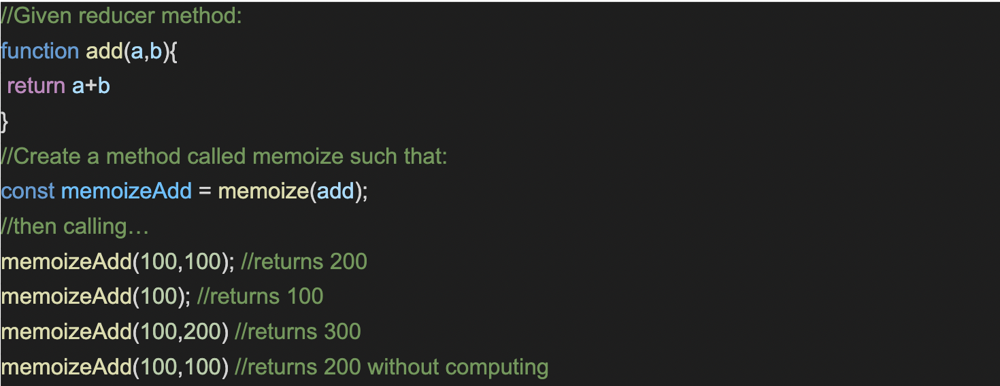
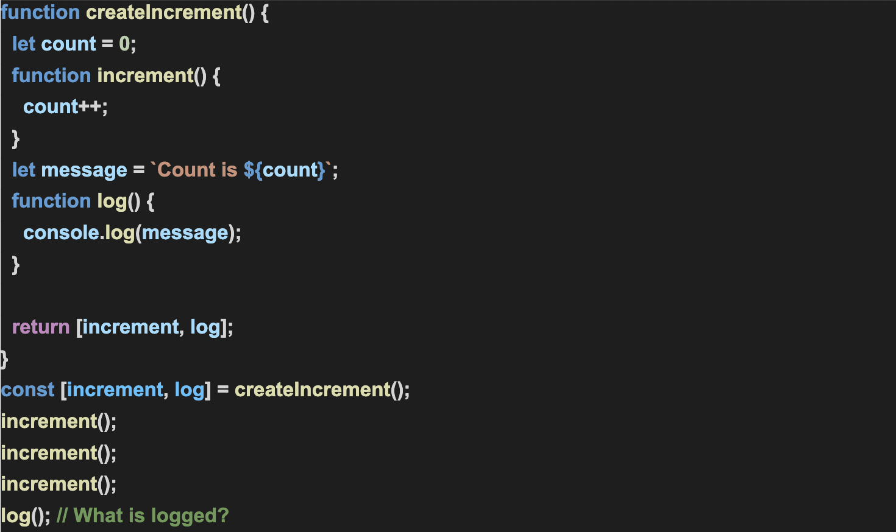
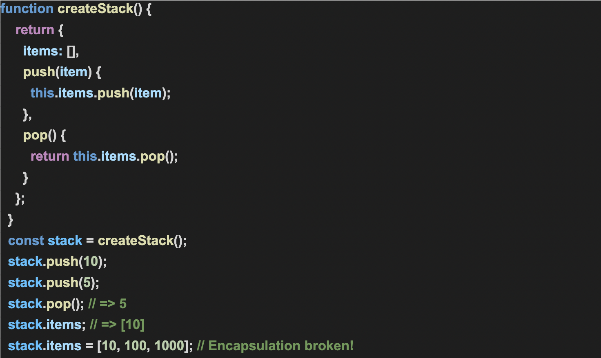
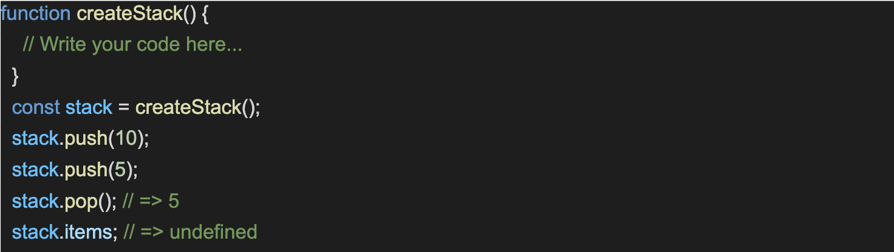

# Week 3 Assignment
### Exercise 3.1: 
Create a memoize function that remembers previous inputs and stores them in cache so that itwon’t have to compute the same inputs more than once. The function will take an unspecifiednumber of integer inputs and a reducer method.**(1.5hours)** 

Example: 

Guidelines:
1. The memozie function should be written from scratch.
2. 3rd party libraries such as loaddash or underscore should not have been used.
3. The function should carry a name which should denote the functionality of it.
4. The function should be able to take n number of arguments.

Outcome:
1. Understanding how caching works.
2. Why is it important?
3. What a browser is capable of doing.
4. The problem memoization solves.

### Exercise 3.2: 
Create 3 simple functions where call, bind and apply are used. The intention of this exercise isto understand how they work and their differences.**(0.5 hours)**

Guidelines:
1. The candidate should be able to explain what call, bind and apply in JS are and its differences.
2. Using live examples the candidate should be able to differentiate between them.

Outcome:
1. Call, Bind, Apply are very important JS concepts.
2. This exercise should help understand them and also understand the differences between them.
3. Writing examples for the same will help the candidate have a better understanding of when and how they are used in real world scenarios.

### Exercise 3.3: 
What is the output of the below problem and why:**[30min]**

Example: 

Guidelines:
1. The candidate should be able to explain the code with the desired output.

Outcome:
1. The candidates will understand how ‘closure’ works in JS.
2. The candidates will understand how ‘encapsulation’ works in JS.

### Exercise 3.4: 
Refactor the above stack implementation, using the concept of closure, such that there is noway to access items array outside of createStack() function scope: (2-3 hours)

 
 

Guidelines:
1. The candidate should be able to refactor the code and get the desired output.
2. The candidate should be able to explain the code why it was not working before.
3. The candidate should be able to explain the code why it is working now.

Outcome:
1. The candidates will understand how ‘closure’ works in JS.
2. The candidates will understand how ‘encapsulation’ works in JS.
